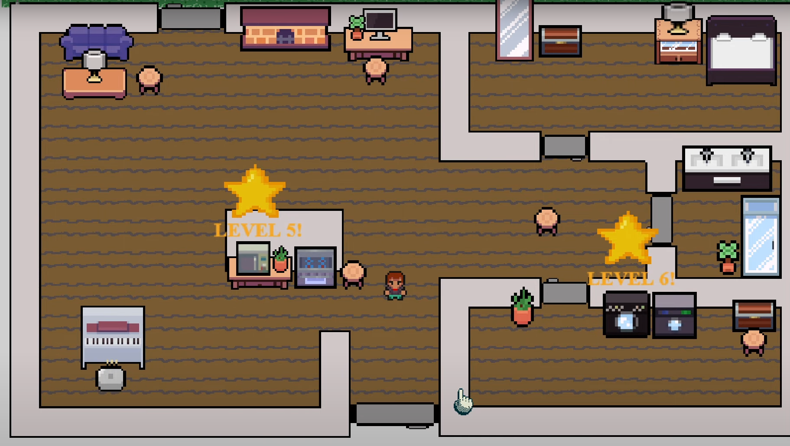

# GDevelop-Group-CMPM
 Group project for CMPM-80K 2024. Roman, Joey, Bryan

 # Spark and Fix
 A game about building and fixing electrical connections. Complete with 6 levels, a main menu, multiple maps, sound effects, and more. We created this project as an assigned for CMPM 80K at UCSC in the 2024 Winter Quarter.

 
 
